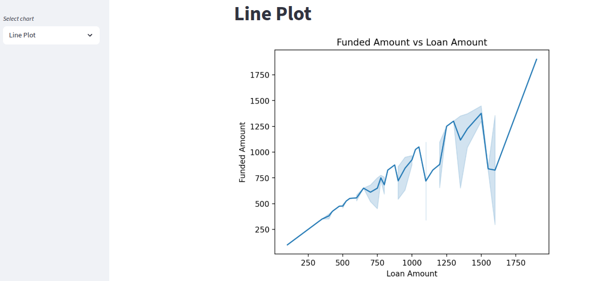

# Streamlit Technical Showcase

### 📊 Project Overview
This project was created to demonstrate proficiency in **Streamlit** as part of my Data Science & Machine Learning bootcamp. The primary focus was on mastering the end-to-end business intelligence workflow, from data ingestion to interactive dashboarding.

### 🛠️ Tech Stack
* **Framework:** Streamlit
* **Data Processing:** Pandas
* **Visualization:** Plotly Express / Graph Objects, Seaborn
* **Deployment:** Streamlit Cloud

### 🖼️ Dashboard Preview

*Quick look at the main layout and key KPIs.*

### 🚀 How to Run Locally
1. Clone the repo: `git clone https://github.com/jposluszny/Streamlit-Project.git`
2. Install dependencies: `pip install -r requirements.txt`
3. Run the app: `streamlit app.py`

### 🔗 Resources
* [**📊 Interactive Dashboard (Live)**](https://streaml-project.streamlit.app/) – Access the full interactive report with filters.

---
*Created by **jposluszny** as part of a Data Science & ML training path.*